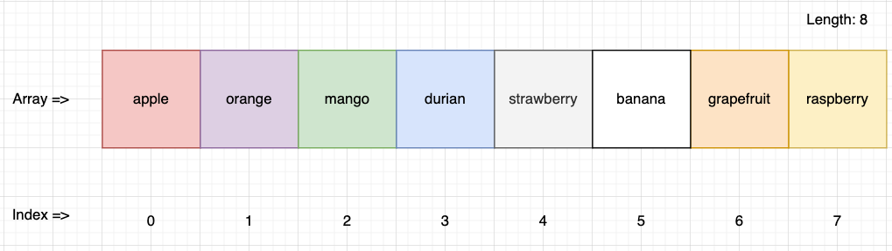

# Lesson

## Lesson Overview

Arrays and loops are common use cases in web development. For instance, an e-commerce website listing product page would loop through an array of products fetched from a backend server. Another instance, a page showing reports will list records in a tabular format by looping through each records fetched from a backend server.

By the end of this lesson, we will be able to create a mini word-guessing game where:

1. User will input 1 word
2. System will match the word against an array of pre-defined word
3. Produce an output how many words matches are found

A complete and functional code sample can be found in [this directory](./src/lesson).

---

## Part 1 - Initializing an array

What is an array? As a variable stores a single value, an array is capable of storing a sequence of values/elements. The elements in the array can be retrieved by its index. Consider the following diagram:



This is how we initialize an empty array:

```js
let fruits = [];
```

This is how we initialize an array with default elements:

```js
let fruits = ["apple", "orange", "mango", "durian"];
```

To add a new element to the end of the array, we can use the `.push()` function:

```js
fruits.push("strawberry");
console.log(fruits); // prints from "apple" to "strawberry"
```

We can also produce an array from a string of texts:

```js
const fruitStr =
  "apple orange mango durian strawberry banana grapefruit raspberry";
let fruits = fruitStr.split(" ");
console.log(fruits); // prints from "apple" to "raspberry"
```

We retain the last snippet of the code to develop the mini word-guessing game.

---

## Part 2 - Looping an array

We will be using `for-loop` to iterate through the array of fruits. This is how a `for-loop` looks like:

```js
/*
    The parentheses contains 3 sections of code:
    1. Initialization: variable (i)
    2. Condition: just like if-statement. In this case, the condition is whether i is less than 5.
    3. AfterThought: What to do when the condition is match. In this case, i is incremented by 1.
*/
for (let i = 0; i < 5; i++) {
  // This block of code will execute 5 times
  // The value of i starts from 0, and increment by 1 after each loop
  console.log(i);
}
```

To loop/iterate through an array, we can involve the array's length in the loop's condition:

```js
// This loop will iterate based on the length of fruit array
for (let i = 0; i < fruits.length; i++) {
  console.log(fruits[i]); // prints out each fruit in the array
}
```

For now, we will hard code the `input`. If the word is matched, we want to print _Congratulations!!_ and exit the loop immediately using the keyword `break`. If the word has no match, we will print _Word has no match_.

The code will now look like this:

```js
const fruitStr =
  "apple orange mango durian strawberry banana grapefruit raspberry";
let fruits = fruitStr.split(" ");

const input = "banana";
let hasMatch = false; // Use to check if there is a match

for (let i = 0; i < fruits.length; i++) {
  const currentFruit = fruits[i];
  console.log("Current Fruit:", currentFruit); //To check what is the current food

  if (currentFruit.toLowerCase() === input.toLowerCase()) {
    hasMatch = true; // Set to true when there is a match
    console.log("Congratulations!! You have found the fruit");
  }

  if (hasMatch) {
    break;
  }
}

// Notify user when there is no match
if (!hasMatch) {
  console.log("Fruit is not found.");
}
```

---

## Activity - Code Challenge

### Code Challenge 1 - Convert for-loop to while-loop

You have observed how for-loop works. In this section, you shall challenge yourself to be resourceful by referencing online materials to refactor the code from using for-loop to while-loop. The outcome of the code shall remain identical except a while-loop is used instead of the for-loop.


### Code Challenge 2 (Advanced) - Prompt for User Input

Right now, the variable `input` is an hard coded value. Do some research and attempt to refactor the current code to get an user input and store the input in the `input` variable.

Hint:

- You have to use an external library, leveraging on `require` keyword.
- Once implemented correctly, you must run the command `node lesson-1.js` and not right-click file > "Run Code".

END
